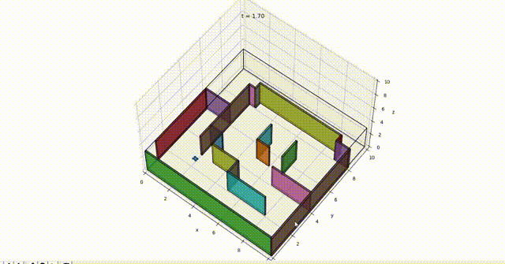
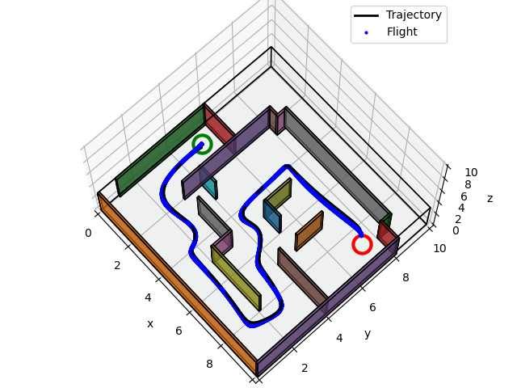
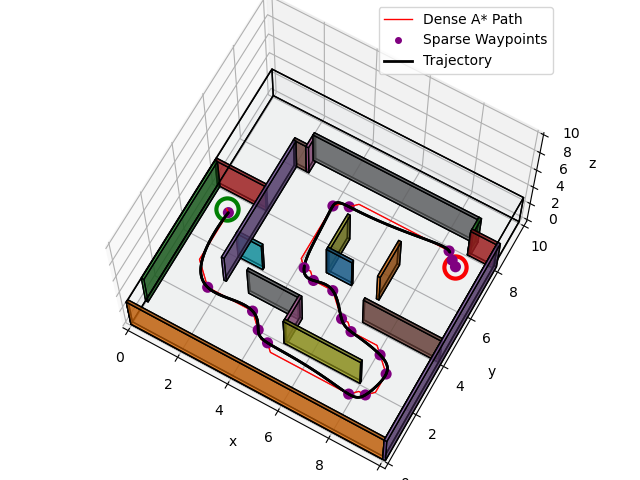
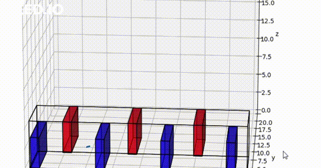
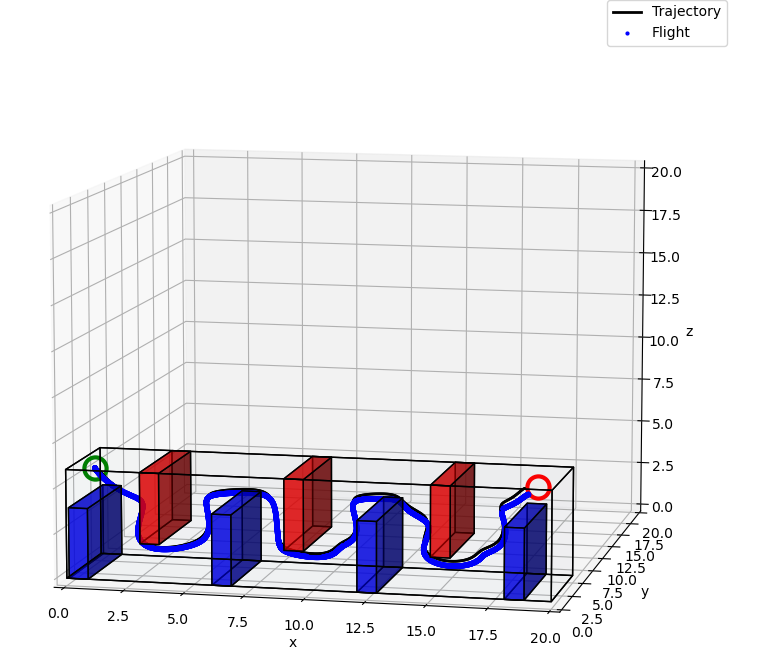
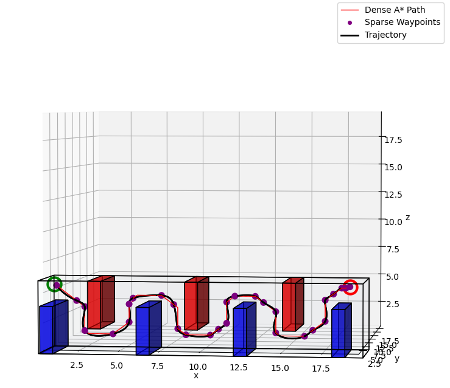
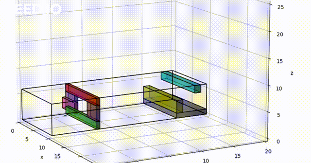
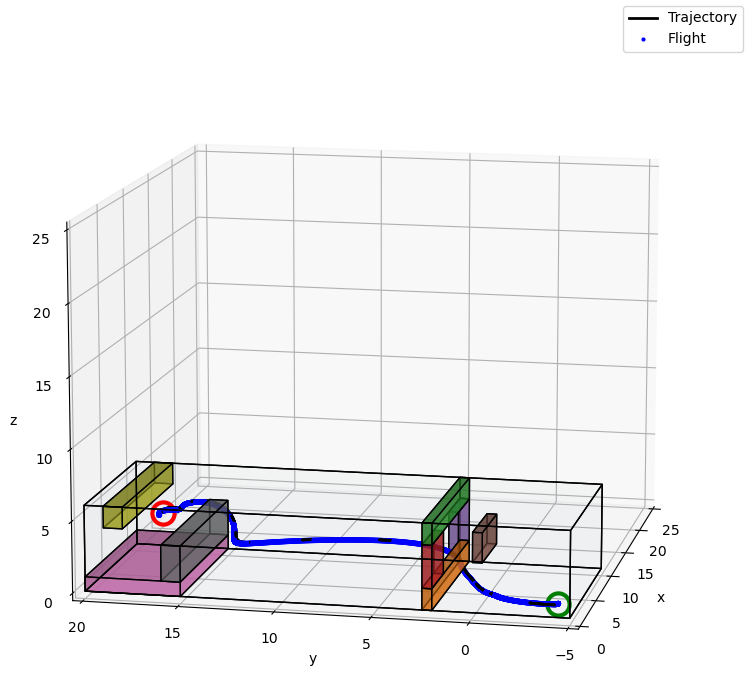
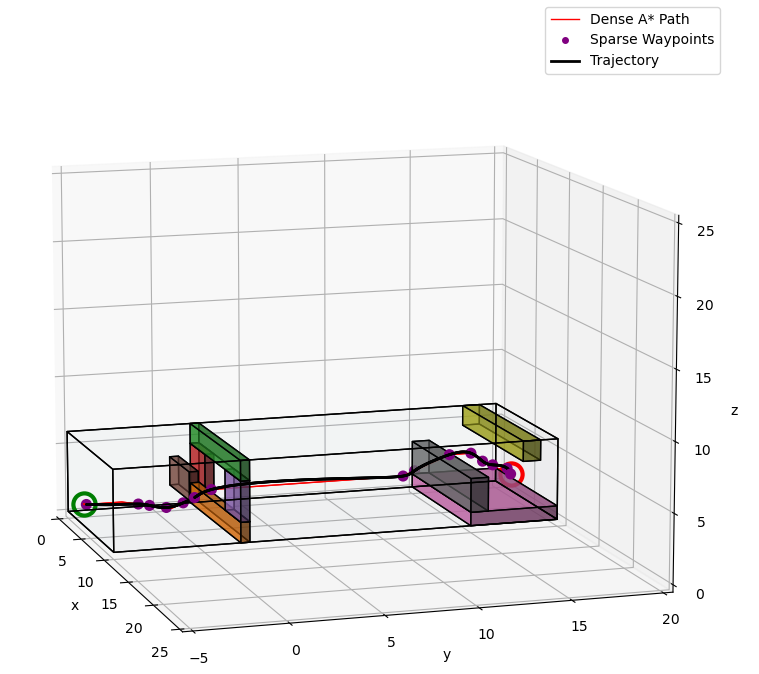

# CrazyFlie Quadrotor Planning and Control

This project was completed as part of the MEAM620 course at UPenn and involved the control and dynamics of a quadrotor. The main objectives were to plan a safe and efficient path through obstacles and accurately estimate the quadrotor's pose using an <strong>Error State Kalman filter (ESKF)</strong> that combined IMU measurements and stereo pair camera images.

To achieve these objectives, I used Djikstra's and A* algorithms to plan a path for the quadrotor through obstacles. The ESKF algorithm was then employed to estimate the quadrotor's position and orientation in real-time. The fusion of IMU measurements and stereo pair camera images provided accurate and reliable estimates of the quadrotor's pose.

This project helped me gain valuable insight into advanced robotics and the challenges associated with controlling and navigating a quadrotor in complex environments. The successful implementation of the ESKF and path planning algorithms demonstrated the effectiveness of these techniques in enhancing the quadrotor's navigation capabilities.

The controller was also implemented on a CrazyFlie quadrotor to simulate in the real world.

# Project Structure
The project consists of the following modules:

- Quadrotor dynamics and control 
- Dijkstra's and A* algorithms for path planning 
- Error State Kalman Filter for pose estimation using IMU and stereo pair camera images 

# Dependencies
- Python 3.6 or above
- Gazebo
- ROS
- OpenCV
- NumPy

# Results

The quadrotor successfully navigated through obstacles and reached the goal without collisions, demonstrating the effectiveness of the path planning and pose estimation techniques employed in this project.

Below are some of the maps :

## Map 1 : Maze
<table>
  <tr>
      <td align = "center">  </td>
      <td align = "center">  </td>
      
  </tr>
  <tr>
      <td align = "center"> Maze</td>
      <td align = "center"> Calculated trajectory and path taken </td>
      
  </tr>
    <tr>
      <td align = "center">  </td>
  </tr>
  <tr>
      <td align = "center"> A* path and Waypoints </td>
  </tr>
</table>

## Map 2 : Up-Down

<table>
  <tr>
      <td align = "center">  </td>
      <td align = "center">  </td>
  </tr>
  <tr>
      <td align = "center">Up Down</td>
      <td align = "center"> Calculated trajectory and path taken </td>
      
  </tr>
  <tr>
      <td align = "center">  </td>
  </tr>
  <tr>
      <td align = "center"> A* path and Waypoints </td>
  </tr>
  
</table>

## Map 3 : Window

<table>
  <tr>
      <td align = "center">  </td>
      <td align = "center">  </td>
      <td align = "center">  </td>
  </tr>
  <tr>
      <td align = "center"> Window</td>
      <td align = "center"> Calculated trajectory and path taken </td>
      <td align = "center"> A* path and Waypoints </td>
  </tr>
</table>
